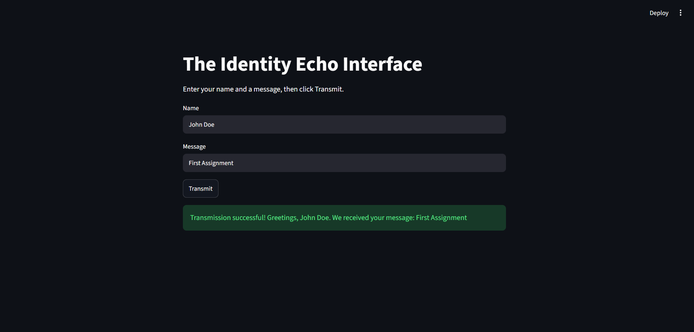
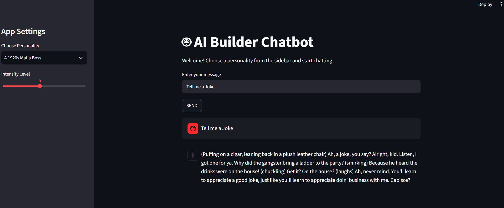
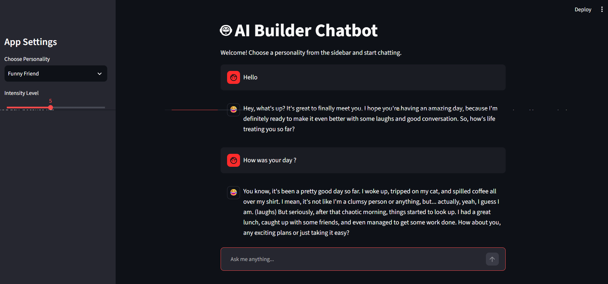
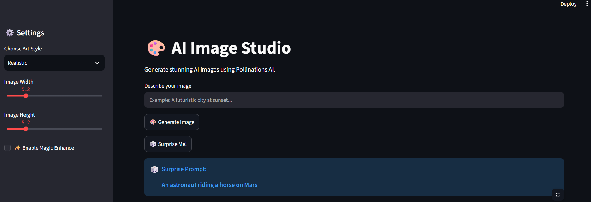
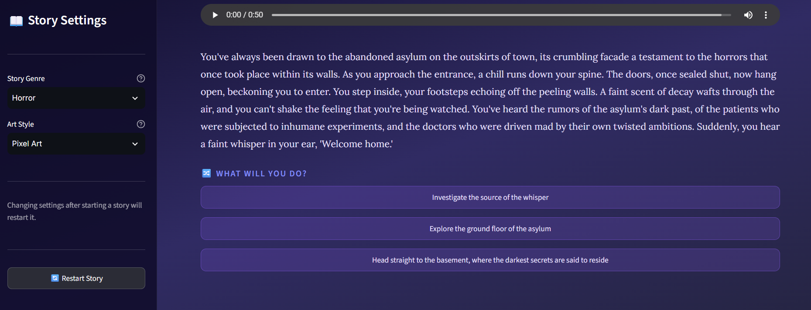

# MirAI Internship Assignments

## MirAI School of Technology – Virtual Summer Internship 2026

This repository contains the assignments completed as part of the **MirAI School of Technology – Virtual Summer Internship 2026**. Each assignment focuses on building practical AI-powered applications using Python and Streamlit while learning prompt engineering, API integration, and modern UI development.

---

# 📁 Assignments

## Assignment 1 – The Identity Echo Interface

### 📌 Objective

Build a simple Streamlit application that collects a user's name and message, validates the inputs, and displays personalized feedback.

### ✨ Features

* User-friendly Streamlit interface
* Input field for user's name
* Input field for user's message
* **Transmit** button
* Input validation

  * Error if the name is empty
  * Warning if the message is empty
* Personalized success message using Python f-strings
* Bonus: Token Cost Estimator (approximate token usage based on message length)

### 📚 Learning Outcomes

* Creating a Streamlit application
* Using `st.title()` and `st.write()`
* Collecting user input with `st.text_input()`
* Creating buttons using `st.button()`
* Implementing conditional logic (`if`, `elif`, `else`)
* Displaying feedback using:

  * `st.error()`
  * `st.warning()`
  * `st.success()`
  * `st.info()`
* Using Python f-strings
* Estimating token usage

---

# Assignment 2 – Upgrading the AI Multiverse

### 📌 Objective

Upgrade a basic AI chatbot into a modern conversational web application by integrating AI personalities, prompt engineering, sidebar controls, and a chat-based interface.

### ✨ Features

* AI-powered chatbot built with **Streamlit**
* AI model integration using the **Groq API**
* Multiple AI personalities:

  * Friendly Teacher
  * Expert Hacker
  * Funny Friend
  * A Panicked College Student at 3 AM
  * A 1920s Mafia Boss
  * A Highly Sarcastic Fitness Coach
* Sidebar-based application settings
* Adjustable **Intensity Level (1–10)** to control personality behavior
* Prompt engineering using Python f-strings
* Modern chat interface using `st.chat_message()`
* Dynamic emoji avatars based on the selected personality
* Clean and interactive user interface

### 📚 Learning Outcomes

* Integrating an AI API into a Streamlit application
* Loading API keys securely using `.env`
* Prompt engineering
* Working with sidebar components
* Using `st.sidebar.selectbox()`
* Using `st.sidebar.slider()`
* Using `st.chat_message()` for chat interfaces
* Applying Python control flow (`if`, `elif`, `else`)
* Creating dynamic UI elements
* Building interactive AI-powered applications

---

# Assignment 3 – The Memory Vault (Stateful Chatbot)

### 📌 Objective

Upgrade the AI chatbot from a stateless application to a stateful conversational assistant by implementing persistent chat history using Streamlit's `st.session_state`.

### ✨ Features

* Persistent chat history using `st.session_state`
* Modern chat interface with `st.chat_input()`
* Displays previous conversations automatically using `st.chat_message()`
* Stores both user and AI messages across Streamlit reruns
* Chat history remains visible even after changing sidebar settings
* AI personalities and intensity controls from Assignment 2 remain fully functional
* Dynamic emoji avatars based on the selected personality
* Improved conversational experience with memory support

### 📚 Learning Outcomes

* Understanding Streamlit Session State
* Building stateful conversational applications
* Managing application state across Streamlit reruns
* Using `st.chat_input()`
* Using `st.chat_message()`
* Storing and rendering chat history
* Combining prompt engineering with conversation memory

---

# Assignment 4 – Upgrading the AI Image Studio

### 📌 Objective

Upgrade a basic AI Image Studio into a more polished AI-powered image generation application by fixing existing bugs, improving the user experience, and adding creative new features using the Pollinations AI Image API.

### ✨ Features

* AI image generation using **Pollinations AI**
* Clean and interactive **Streamlit** user interface
* Prompt-based image generation
* Multiple art styles:

  * Realistic
  * Anime
  * Fantasy
  * Cyberpunk
  * Oil Painting
  * Pixel Art
* Adjustable image **Width** and **Height** using sidebar sliders
* **Magic Enhance** mode for automatically improving prompts with high-quality descriptive keywords
* **Surprise Me!** button for generating images from random creative prompts
* Image preview inside the application
* Download generated images as **.png** files
* Dynamic download filename based on the selected art style
* Loading spinner while generating images
* Responsive sidebar settings

### 📚 Learning Outcomes

* Building AI-powered image generation applications
* Working with REST APIs using the `requests` library
* Handling images using the **Pillow (PIL)** library
* URL encoding using `urllib.parse`
* Working with query parameters in HTTP requests
* Using Streamlit sidebar components
* Implementing sliders, checkboxes, and buttons
* Creating reusable functions
* Applying conditional logic
* Downloading files using `st.download_button()`
* Using Python's `random` module for dynamic content
* Improving user experience with loading indicators and interactive controls

---

# Assignment 5 – AI Visual Novel

### 📌 Objective

Build an interactive AI-powered visual novel application featuring dynamic narrative branching, visual scene generation, and text-to-speech audio narration using Groq, Pollinations AI, and gTTS.

### ✨ Features

* Interactive Visual Novel engine built with **Streamlit**
* Multi-turn story generation powered by **Groq API** (`llama-3.3-70b-versatile`)
* Enforced JSON response schema for story text, image prompts, and choices
* AI image generation for scenes using **Pollinations AI**
* Text-to-Speech (TTS) audio narration using **gTTS**
* Sidebar controls for customizable **Genre** (Fantasy, Horror, Sci-Fi, Mystery, Adventure) and **Art Style** (Anime, Realistic, Watercolor, Cyberpunk, Pixel Art)
* Dynamic interactive choice buttons for narrative progression
* Persistent story history rendering using `st.session_state`
* Read-only historical scene view preserving past text, images, and audio playback
* **Restart Story** button to reset conversation history and state
* Graceful error handling and fallbacks for external APIs
* Modern custom CSS UI with dark gradients and glassmorphic scene cards

### 📚 Learning Outcomes

* Implementing stateful multi-turn AI storytelling
* Advanced prompt engineering for strict JSON outputs
* Combining LLM responses with image generation and audio synthesis pipelines
* Managing persistent story history with `st.session_state`
* Dynamic UI rendering for past vs. current scene choices
* Implementing graceful degradation with `try-except` error handling
* Enhancing Streamlit applications with custom CSS styling

---

# 🛠️ Technologies Used

* Python 3
* Streamlit
* Groq API
* python-dotenv
* Pollinations AI API
* gTTS (Google Text-to-Speech)
* requests

---

# 📂 Project Structure

```text
Assignments/
│
├── Assignment 1/
│   ├── app.py
│   ├── requirements.txt
│   ├── README.md
│   └── .gitignore
|
├── Assignment 2/
│   ├── app.py
│   ├── requirements.txt
│   ├── README.md
│   ├── .env (not included)
│   └── .gitignore
│
├── Assignment 3/
│   ├── app.py
│   ├── requirements.txt
│   ├── README.md
│   ├── .env (not included)
│   └── .gitignore
|
├── Assignment 4/
│   ├── app.py
│   ├── requirements.txt
│   └── .gitignore
│
├── Assignment 5/
│   ├── app.py
│   ├── assets/
│   │   ├── images/
│   │   └── audio/
│   ├── .env (not included)
│   └── .gitignore
│
├── screenshots/
│
└── README.md

```

---

# 🚀 Installation

### 1. Clone the repository

```bash
git clone https://github.com/Junaid-786-29/Mirai-Internship-Assignments.git
```

### 2. Navigate to the project

```bash
cd Mirai-Internship-Assignments
```

### 3. Install the required packages

```bash
pip install -r requirements.txt
```

### 4. Create a `.env` file

```env
GROQ_API_KEY=your_api_key_here
```

### 5. Run the application

```bash
streamlit run app.py
```

---

# 📸 Preview

### Assignment 1



---

### Assignment 2



---

### Assignment 3



---

### Assignment 4



---

### Assignment 5



---

# 🎯 Skills Demonstrated

* Python Programming
* Streamlit Development
* AI API Integration
* Prompt Engineering
* Environment Variable Management
* User Interface Design
* Chatbot Development
* Conditional Logic
* Python f-strings
* Dynamic User Interfaces
* Streamlit Session State
* Stateful Chatbot Development
* Conversation Memory Management
* Interactive Chat Interfaces
* AI Image Generation
* REST API Integration
* Pollinations AI API
* Image Processing with Pillow
* HTTP Query Parameters
* URL Encoding
* Streamlit Download Button
* Dynamic File Downloads
* Interactive Streamlit Sidebar
* User Experience (UX) Enhancements
* Randomized Content Generation
* Text-to-Speech (TTS) Synthesis
* Multi-Turn Story Generation
* JSON Output Formatting
* Custom CSS UI Styling

---

# 📄 License

This repository was created for educational purposes as part of the **MirAI School of Technology – Virtual Summer Internship 2026**.
